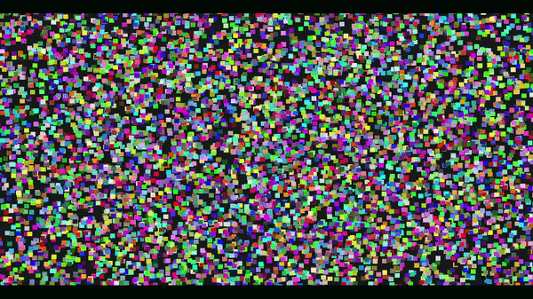
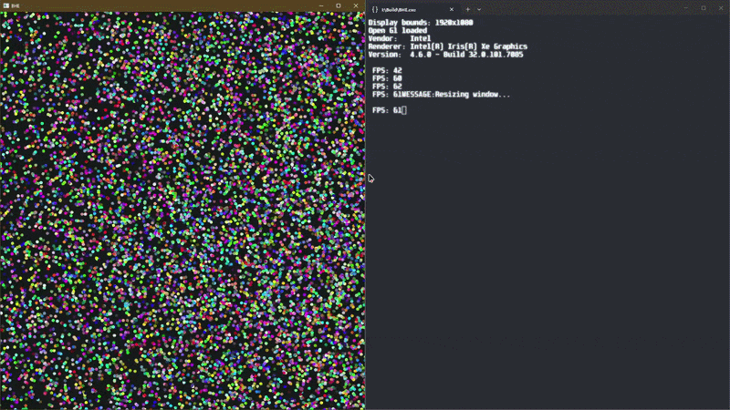
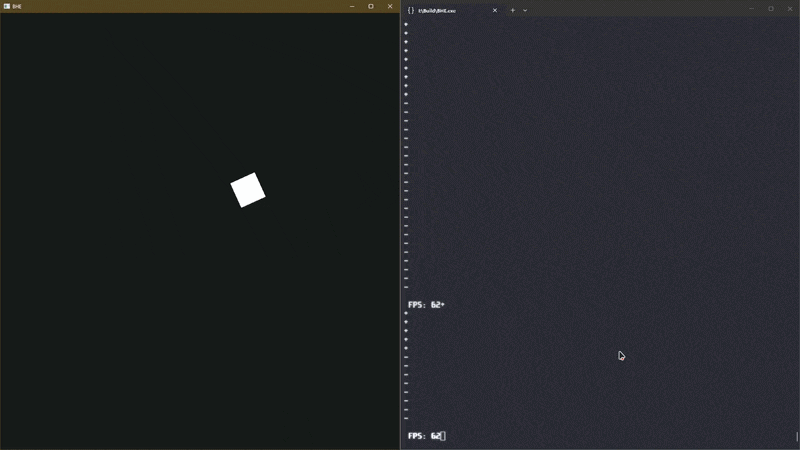

# FYP

Backup repository for a Final Year Project (FYP) — currently under development.

Status: **Under Construction**

## Description
A specialised bullet-hell game engine / toolkit that is optimized to handle large projectile counts  and provide the necessary tools for creating a bullet-hell game.

## Key Technologies
- Primary language: C
- External Libraries: OpenGl,Sdl

## Features (Work-in-progress)
- Gameplay Loop
- input system
- rendering system : instance rendering , Camera System , objects (quad / circle ) drawing
- partial physics system : broadphase and narrow phase (using spatial hashing as the resolver)
- entty/object system
- ..... to be added

### Some videos demonstrating some of what is done
[](https://mmuedumy-my.sharepoint.com/:v:/g/personal/hazim_elamin_mohamed_student_mmu_edu_my/IQD4CYTBtFXPQpdba3t6KV-VAWHYc5UXk83_Lcwsebn92rA?nav=eyJyZWZlcnJhbEluZm8iOnsicmVmZXJyYWxBcHAiOiJPbmVEcml2ZUZvckJ1c2luZXNzIiwicmVmZXJyYWxBcHBQbGF0Zm9ybSI6IldlYiIsInJlZmVycmFsTW9kZSI6InZpZXciLCJyZWZlcnJhbFZpZXciOiJNeUZpbGVzTGlua0NvcHkifX0&e=XWowpM)

[](https://mmuedumy-my.sharepoint.com/:v:/g/personal/hazim_elamin_mohamed_student_mmu_edu_my/IQBmEQDC1rqjQJI_zHbd59y5AbFffZkBLJP5huE0AZOHrrA?nav=eyJyZWZlcnJhbEluZm8iOnsicmVmZXJyYWxBcHAiOiJPbmVEcml2ZUZvckJ1c2luZXNzIiwicmVmZXJyYWxBcHBQbGF0Zm9ybSI6IldlYiIsInJlZmVycmFsTW9kZSI6InZpZXciLCJyZWZlcnJhbFZpZXciOiJNeUZpbGVzTGlua0NvcHkifX0&e=d1tHbE)

[](https://mmuedumy-my.sharepoint.com/:v:/g/personal/hazim_elamin_mohamed_student_mmu_edu_my/IQBE9PT_dPjNTrMeyohV3S47AU3R9HrwipHucyY5ZWiFA_c?nav=eyJyZWZlcnJhbEluZm8iOnsicmVmZXJyYWxBcHAiOiJPbmVEcml2ZUZvckJ1c2luZXNzIiwicmVmZXJyYWxBcHBQbGF0Zm9ybSI6IldlYiIsInJlZmVycmFsTW9kZSI6InZpZXciLCJyZWZlcnJhbFZpZXciOiJNeUZpbGVzTGlua0NvcHkifX0&e=Hjsona)

[](https://mmuedumy-my.sharepoint.com/:v:/g/personal/hazim_elamin_mohamed_student_mmu_edu_my/IQD3zgq49mqgQbsLAdxukHQ6AUm2eo002EddPjfeu_tJung?nav=eyJyZWZlcnJhbEluZm8iOnsicmVmZXJyYWxBcHAiOiJPbmVEcml2ZUZvckJ1c2luZXNzIiwicmVmZXJyYWxBcHBQbGF0Zm9ybSI6IldlYiIsInJlZmVycmFsTW9kZSI6InZpZXciLCJyZWZlcnJhbFZpZXciOiJNeUZpbGVzTGlua0NvcHkifX0&e=cGXOEz)

## Build 
- I use a batch file for building the project.
- The engine is compiled using the microsft compiler as I use studio debugger for debugging.
- If u want you can try running build.bat and hopefully it does build the project (the current state its in is purely for testing and building what feature been added)

## Running
- navigate to the `Build` dir
- execute the BHE.exe  

## Project Structure 
```
├── engine/                 # Core engine systems
│   ├── dataStructs/        # Custom data structures 
│   ├── physics/            # Physics system 
│   ├── render/             # Rendering system 
│   │   └── camera/         # Camera-specific logic
│   ├── Profiling/          # Performance tools 
│   ├── *.c / *.h           # Core engine modules 
│
├── objects/                # Game objects and shape definitions
│   ├── shapes.c
│   └── shapes.h
│
├── shaders/                # GLSL shader files
│   ├── default.vert
│   └── default.frag
│
├── io/                     # File I/O utilities
│   ├── io.c
│   └── io.h
│
├── Util/                   # Utility modules 
│   ├── PCG_RNG.c
│   └── cpu.h
│
├── main.c                  # Entry point / game loop
├── helpers.c / helpers.h   # General helper functions
├── glad.c                  # OpenGL loader
├── keyboardTable.h         # Input key mapping
├── types.h                 # Shared type definitions
│
├── todo.org                #  TODOs
```

## License
---

---

## Current TODO
---
# TODO API
- [ ]  Core Engine Control (partially)
- [x] Entity and Component Management
- [ ] Bullet Pattern Authoring
- [ ] Collision System
- [ ] Rendering and Visuals
- [ ] Input Handling
- [ ] Audio Management


# TODO Rendering system

- [x] Remove per frame malloc/realloc in batching  
- [x] Stop orphaning instance VBO every draw  
- [x] Add renderShutdown() to free batch instance  
- [x] Add rotation support to Quad  
- [x] Fix renderAABB to work without breaking batched state (draw after batching or as line)  
- [x] Add circle rendering  
- [x] Add camera/view transform  
- [ ] Add Background rendering for levels  
- [ ] Add layer/Z ordering  
- [ ] Implement persistent mapped buffer for high bullet counts  
- [ ] Add simple text output (bitmap font via instanced quads) for debug  
- [ ] Add frustum culling to skip off screen  

# TODO Window events

## General

- [ ] Handle Resize  
- [ ] Fix the hitbox visualization rendering issues  

- [x] Store updated width/height in a global or struct `WindowDimensions`  
- [x] Trigger a renderer update (recalculate projection, viewport, etc.)  
- [x] Handle Focus / Minimize (what about borderless too?)  

- [ ] Capture `WM_ACTIVATEAPP` / `SDL_EVENT_WINDOW_FOCUS_GAINED` / LOST  
- [ ] Pause the game/editor loop if minimized or unfocused  
- [ ] Handle Close and saving of game data (don’t have a game yet)  


## Input

- [ ] Keyboard events (`wasDown` and `isDown` should be properly handled and logged)  
- [ ] Mouse input   
- [ ] Gamepad support (handle hotplugging properly)  


# TODO Bullet counts

- [ ] Render instancing for bullet meshes (one draw call for at least 100 bullets)  
- [ ] Pool allocate memory for bullets (don’t delete unless the stage is finished)  
---
